# Experiment 1 — FCFS and SJF Scheduling Algorithms

**Date:** 23-07-2026  
**Roll No.:** 25071A6230

## Aim

Write C programs for FCFS scheduling algorithm without arrival times and with arrival times, and SJF scheduling in non-preemptive and preemptive forms.

## Source Files

- [`fcfs_without_arrival.c`](src/fcfs_without_arrival.c)
- [`fcfs_with_arrival.c`](src/fcfs_with_arrival.c)
- [`sjf_non_preemptive.c`](src/sjf_non_preemptive.c)
- [`sjf_preemptive_srtf.c`](src/sjf_preemptive_srtf.c)

## Output Snippets

### FCFS Without Arrival
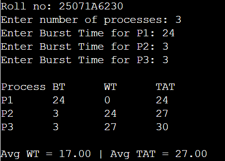
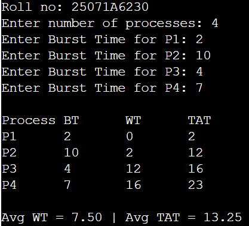
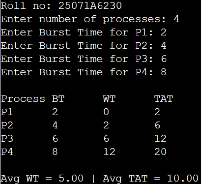

### FCFS With Arrival
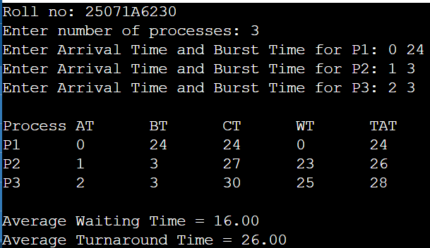
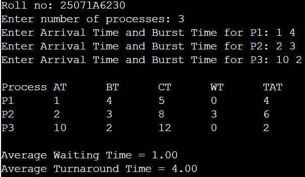
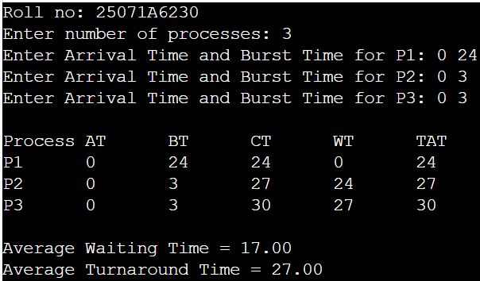

### SJF Non-Preemptive
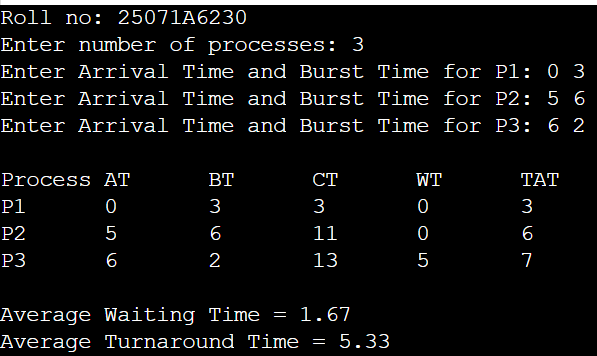
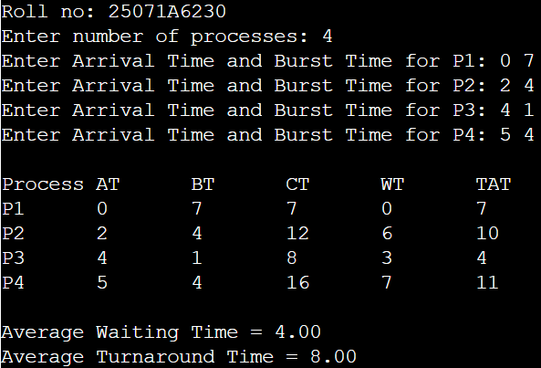
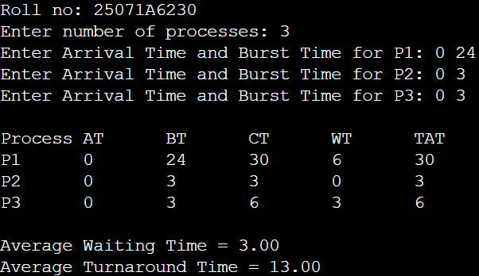

### SJF Preemptive / SRTF
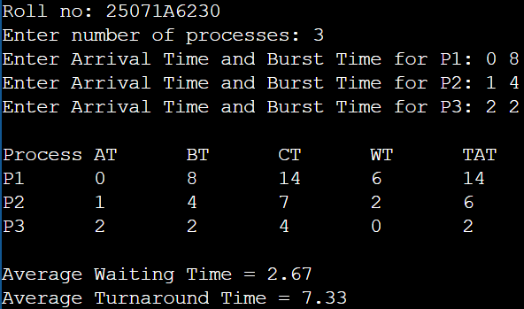
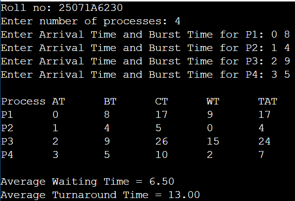
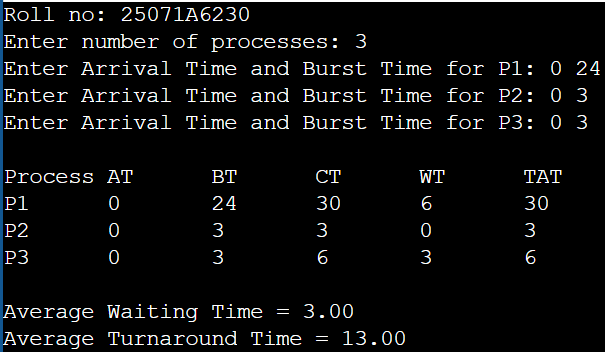
