# Experiment 2 — Priority and Round Robin Scheduling

**Date:** 30-07-2026  
**Roll No.:** 25071A6230

## Priority — Non-Preemptive

The record inputs AT, BT and Priority, initializes the current time and unvisited status, selects an arrived process with the **lowest Priority value**, executes it, calculates CT/TAT/WT, and calculates AWT/ATAT.

## Priority — Preemptive

The record sets RT = BT and repeatedly selects the arrived process with the lowest Priority value. It executes one time unit, decreases RT and records CT when RT reaches zero.

## Round Robin — TQ = 2

The record sets TQ = 2 and RT = BT, selects from the ready queue, executes for two units or until completion, updates RT/time, handles newly arrived processes, requeues unfinished processes and calculates CT/TAT/WT.

## Round Robin — TQ = 10

The same record algorithm is used with TQ = 10.

## Source Files

- [`priority_non_preemptive.c`](src/priority_non_preemptive.c)
- [`priority_preemptive.c`](src/priority_preemptive.c)
- [`round_robin_tq2.c`](src/round_robin_tq2.c)
- [`round_robin_tq10.c`](src/round_robin_tq10.c)

## Output Snippets

### Priority Non-Preemptive
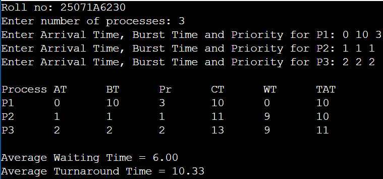
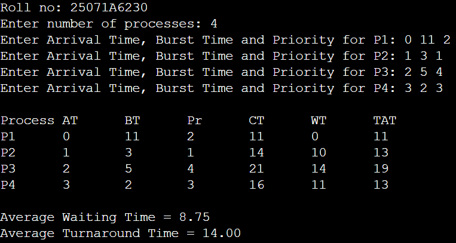
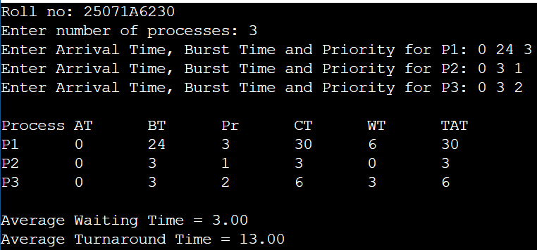

### Priority Preemptive
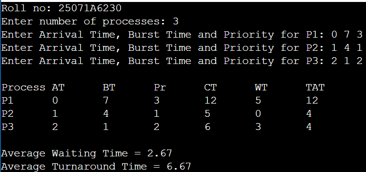
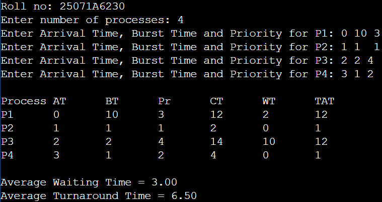
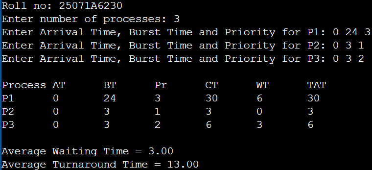

### Round Robin TQ = 2
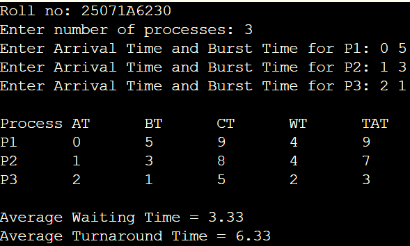
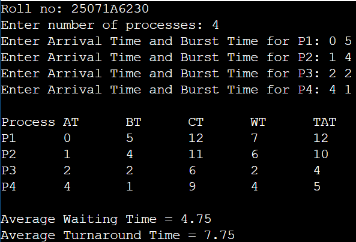
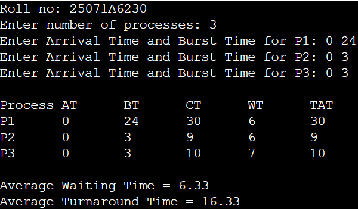

### Round Robin TQ = 10
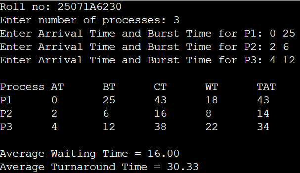
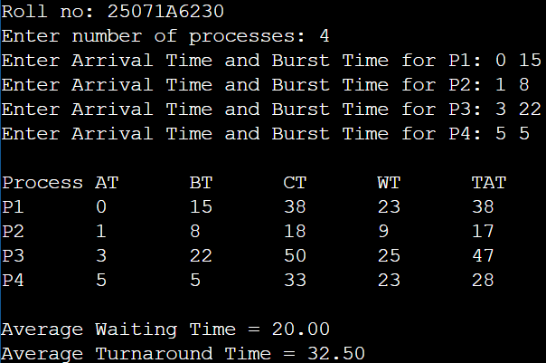
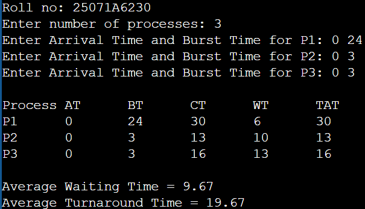
