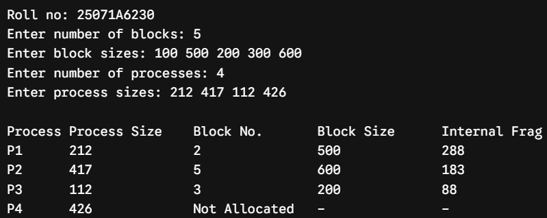
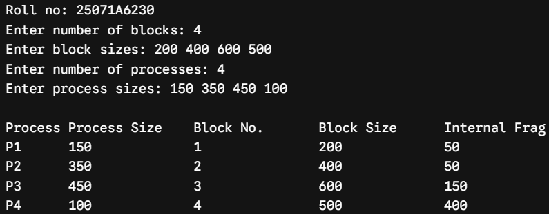
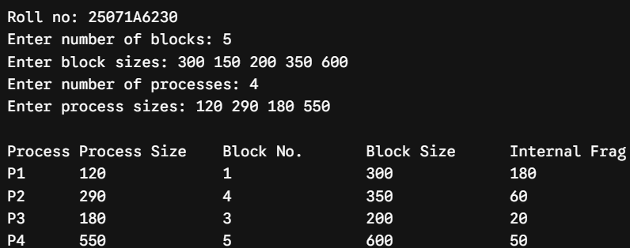
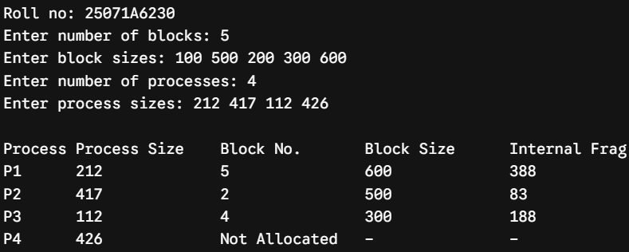
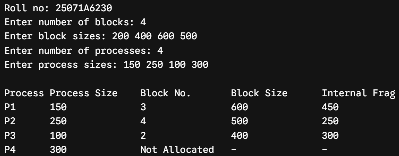
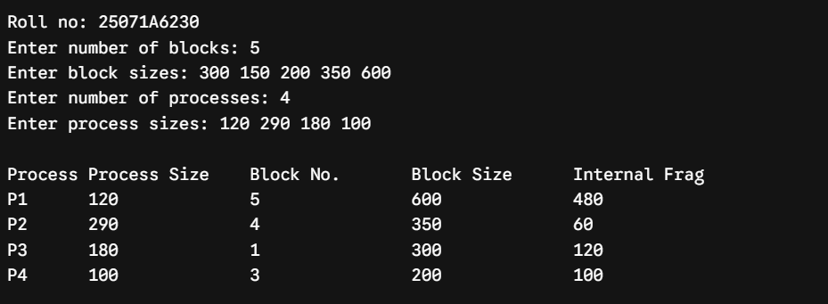
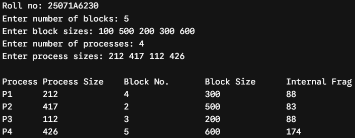
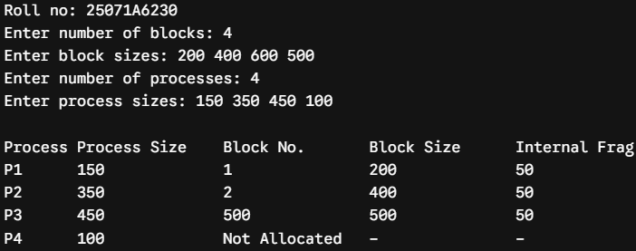
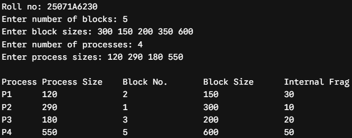

# Experiment 4 — Fixed-Partition Memory Allocation

**Date:** 27-08-2026  
**Roll No.:** 25071A6230

## First Fit

Search partitions from the first partition. Allocate the first unallocated partition large enough for the process. Internal fragmentation is `Partition Size − Process Size`.

[`first_fit.c`](src/first_fit.c)

## Worst Fit

Search all unallocated partitions and select the largest partition that is large enough. Internal fragmentation is `Partition Size − Process Size`.

[`worst_fit.c`](src/worst_fit.c)

## Best Fit

Search all unallocated partitions and select the smallest partition that is large enough. Internal fragmentation is `Partition Size − Process Size`.

[`best_fit.c`](src/best_fit.c)

