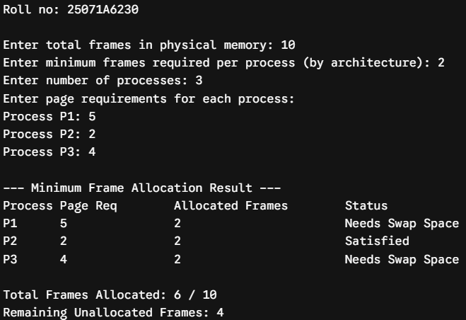
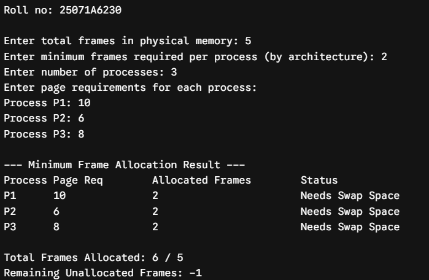
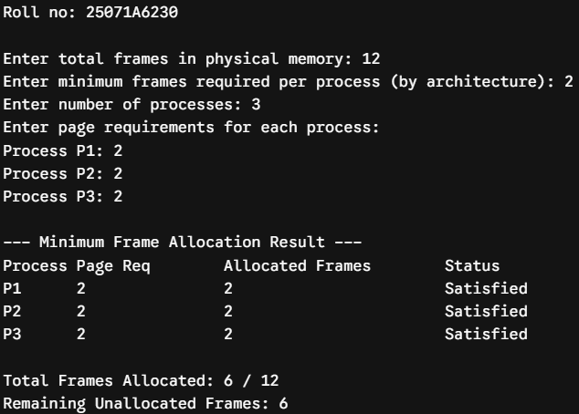
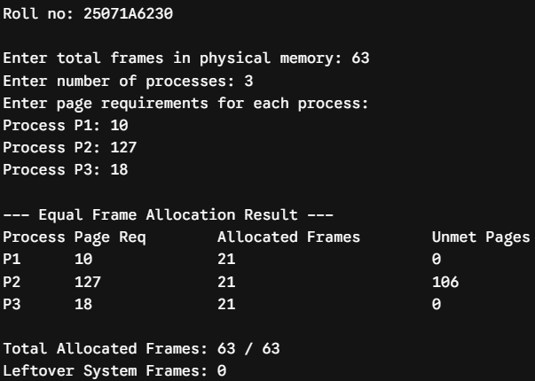
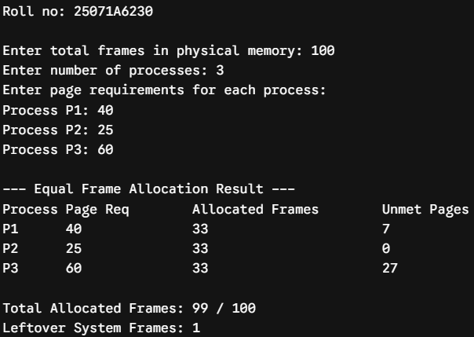
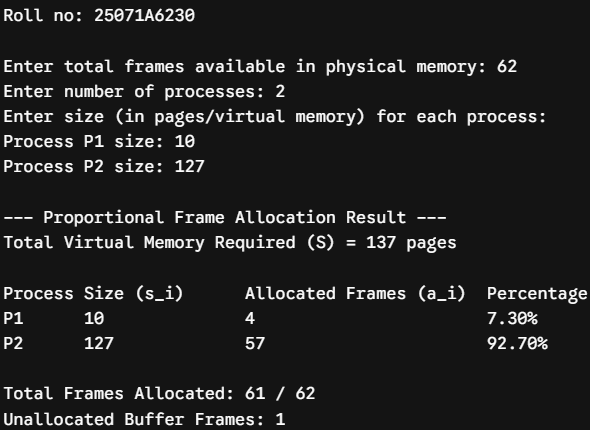
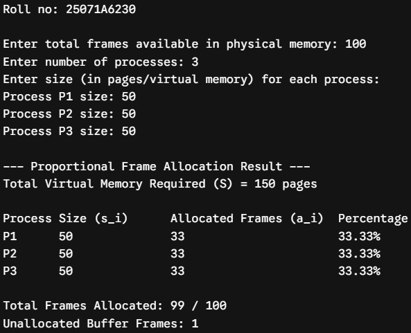

# Experiment 7 — Frame Allocation Methods

**Date:** 03-09-2026  
**Roll No.:** 25071A6230

## Minimum Number of Frames

[`minimum_frame_allocation.c`](src/minimum_frame_allocation.c)

## Equal Allocation

[`equal_frame_allocation.c`](src/equal_frame_allocation.c)

## Proportional Allocation

[`proportional_frame_allocation.c`](src/proportional_frame_allocation.c)

