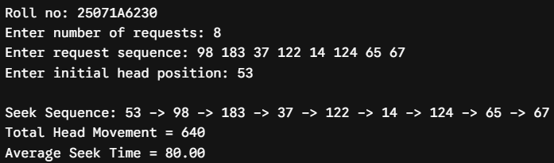
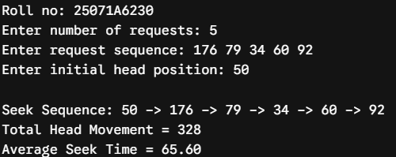
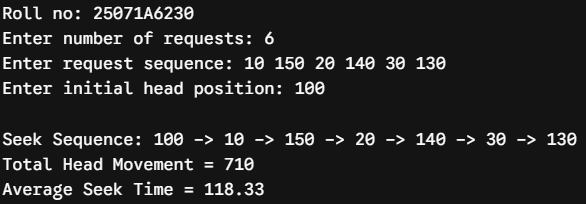
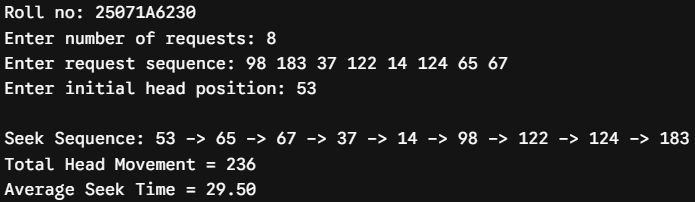
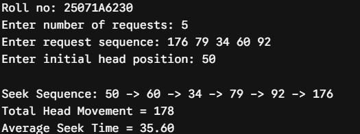
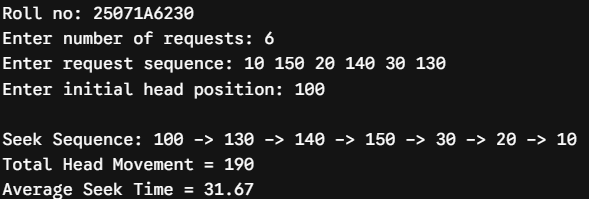
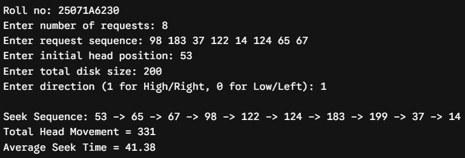
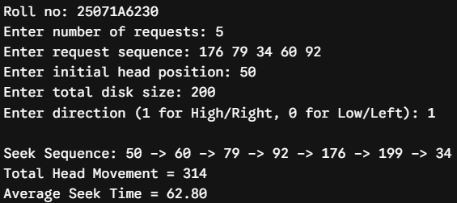
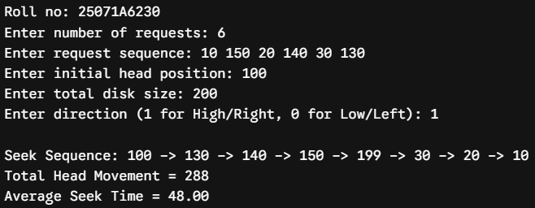

# Experiment 8 — Disk Scheduling: FCFS, SSTF and SCAN

**Date:** 10-09-2026  
**Roll No.:** 25071A6230

## FCFS

[`disk_fcfs.c`](src/disk_fcfs.c)

## SSTF

[`disk_sstf.c`](src/disk_sstf.c)

## SCAN

[`disk_scan.c`](src/disk_scan.c)

