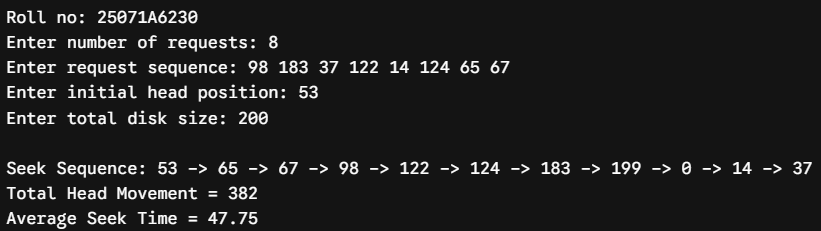
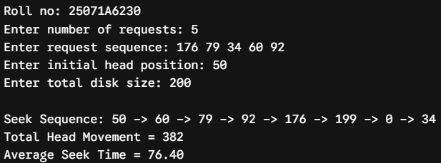
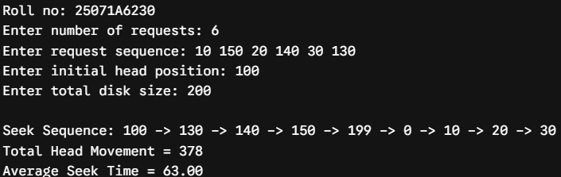
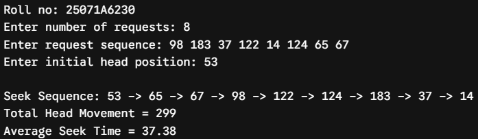
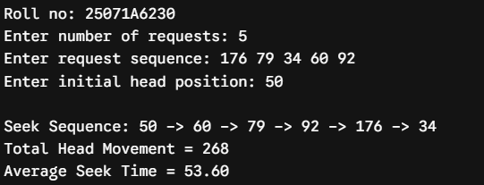
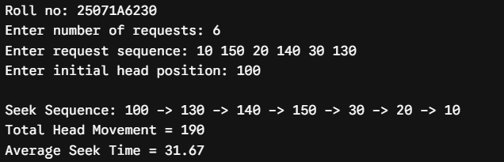
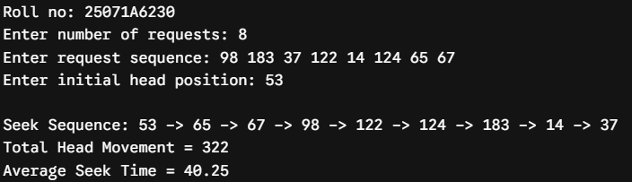
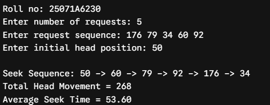
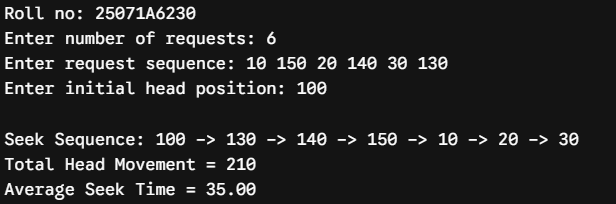

# Experiment 9 — Disk Scheduling: C-SCAN, LOOK and C-LOOK

**Date:** 17-09-2026  
**Roll No.:** 25071A6230

## C-SCAN

[`disk_cscan.c`](src/disk_cscan.c)

## LOOK

[`disk_look.c`](src/disk_look.c)

## C-LOOK

[`disk_clook.c`](src/disk_clook.c)

